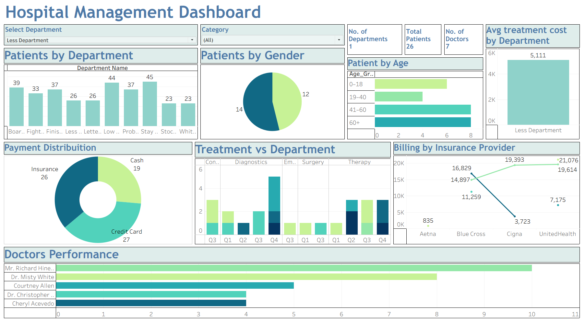

# 🏥 Hospital Management Dashboard – Tableau Project

## 📘 Overview
This project presents a **Hospital Management Dashboard** built in **Tableau**, designed to visualize and analyze hospital operations, patient demographics, doctor performance, and billing insights.  
It provides a unified view of hospital data, helping administrators make data-driven decisions efficiently.

---

## 🎯 Objectives
The dashboard was developed to solve several user requirements and analytical challenges:

| Problem / Requirement | Solution Implemented |
|------------------------|----------------------|
| Lack of centralized view of hospital data | Created a unified Tableau dashboard integrating multiple dimensions and fact tables |
| Need to analyze patient demographics | Added charts for **gender** and **age group** segmentation |
| Difficulty tracking departmental performance | Designed **Patients by Department** and **Avg Treatment Cost by Department** visualizations |
| Inconsistent billing and payment insights | Built **Billing by Insurance Provider** and **Payment Distribution** charts |
| Need to monitor doctor efficiency | Developed **Doctors Performance** section showing patient counts per doctor |
| Requirement for interactive filtering | Implemented **Department** and **Category** filters for dynamic exploration |
| Need for quarterly treatment tracking | Added **Treatment vs Department** chart grouped by quarters (Q1–Q4) |
| Requirement for summary KPIs | Displayed **No. of Departments**, **No. of Doctors**, and **Total Patients** as top-level indicators |

---

## 🧩 Data Model
The dashboard uses a **star schema** with one fact table and multiple dimension tables:

| Table Type | Table Name | Description |
|-------------|-------------|-------------|
| Fact Table | Treatments | Contains treatment IDs, department, doctor, patient, cost, and date |
| Dimension | Patients | Includes patient demographics (age, gender, location) |
| Dimension | Doctors | Lists doctor details and specialties |
| Dimension | Departments | Defines hospital departments and categories |
| Dimension | Procedures | Contains procedure types and categories |
| Dimension | Billing | Tracks payment methods and insurance providers |

Each table was imported as a **CSV file (~1000 records)** for Tableau practice and linked visually using Tableau’s **Data Relationship Model**.

---

## 📊 Dashboard Components

### 1. **Patients by Department**

Bar chart showing patient counts across departments.


### 2. **Patients by Gender**

Pie chart dividing patients into male and female categories.


### 3. **Patient by Age**


Horizontal bar chart showing age group distribution (0–18, 19–40, 41–60, 60+).


### 4. **Avg Treatment Cost by Department**

Bar chart showing average treatment cost per department.


### 5. **Payment Distribution**

Pie chart comparing payment methods (Insurance, Cash, Credit Card).


### 6. **Treatment vs Department**

Quarterly analysis of treatments by category (Consultation, Diagnostics, Emergency, Surgery, Therapy).


### 7. **Billing by Insurance Provider**

Line chart comparing total billing amounts across providers (Aetna, Blue Cross, Cigna, UnitedHealth).


### 8. **Doctors Performance**

Horizontal bar chart ranking doctors by patient count.

---

## ⚙️ Technical Implementation

- **Tool:** Tableau Desktop  

- **Data Source:** Synthetic CSV dataset (Hospital Management Schema)  

- **Schema Type:** Star Schema  

- **Calculated Fields:**  

  - Average Treatment Cost  

  - Age Group Classification  

  - Payment Type Ratio  

- **Parameters:**  

  - Department Filter  

  - Category Filter  

- **Dashboard Actions:**  

  - Interactive filtering  

  - Hover tooltips for detailed insights  

  - Dynamic KPI updates  


---

## 🧠 Insights Derived

- The **Probaby Department** had the highest patient count (45).  

- **Insurance** was the most common payment method.  

- **Dr. Misty White** treated the most patients (~10).  

- **Average treatment cost** for the Board Department was ₹4,696.  

- **Cigna** and **UnitedHealth** showed the highest billing amounts.


---

## 📂 File Structure
```
Hospital_Management_Dashboard/
│
├── data/
│   ├── Treatments.csv
│   ├── Patients.csv
│   ├── Doctors.csv
│   ├── Departments.csv
│   ├── Procedures.csv
│   └── Billing.csv
│
├── tableau/
│   └── Hospital_Management_Dashboard.twbx
│
├── docs/
│   └── ER_Diagram.png
│
└── README.md
```

---

## 🧪 Learning Outcomes

- Practiced **data modeling** and **relationship design** in Tableau.  

- Applied **calculated fields** and **parameters** for dynamic analysis.  

- Designed a **professional dashboard layout** with KPIs, charts, and filters.  

- Enhanced understanding of **hospital analytics** and **business intelligence visualization**.

---

## 🚀 Future Enhancements

- Add **trend analysis** for monthly patient inflow.  

- Integrate **real-time data** via Tableau Server or API.  

- Include **predictive analytics** for treatment cost forecasting.  

- Expand dataset to include **staff scheduling** and **inventory management**.

Dashboard Screenshot:

